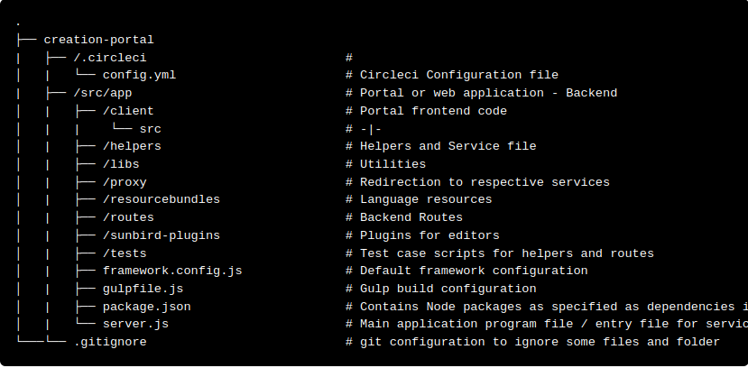
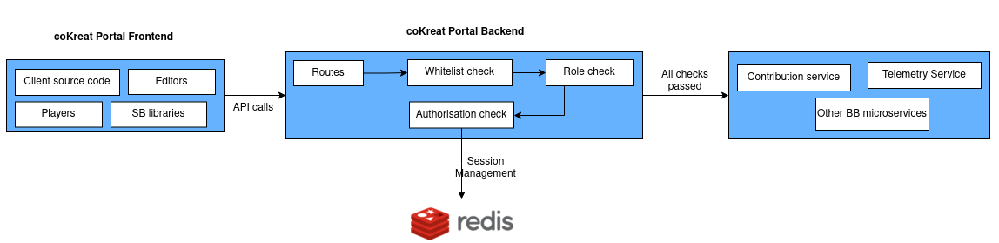
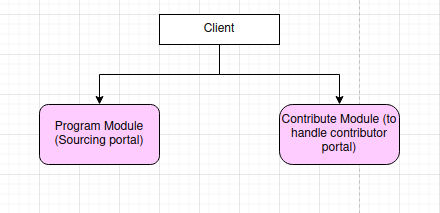

# Project Structure

The source code can be found on :\
GIthub Link => [https://github.com/Sunbird-coKreat/creation-portal/tree/release-6.0.0](https://github.com/Sunbird-coKreat/creation-portal/tree/release-6.0.0)

## The basic code structure

<figure><figcaption></figcaption></figure>

## **CoKreat Portal is divided into two parts**

<figure><figcaption></figcaption></figure>

1. app => Portal backend which routes and validates the APIs executed through frontend
2. client => Portal frontend code base (modules, components, services) which is compiled by browser for user to perform various actions

### **App**

Following files/folders has the code to carry out routing, API whitelist  checking and authrising etc.

#### environmentVariablesHelper

&#x20;\- File resides in app/helpers/environmentVariablesHelper.js\
&#x20;\- All the environment variales necessary for the local set up are initialised here\
\
**Routes**

\- The folder carries out operation of routing the API calls to correct micro service&#x20;

#### Proxy

\- The proxy sits between the Angular app and the backend API and translates the api  calls to backend API.&#x20;

### **Client**&#x20;

&#x20;The following NPM packages which are listed in package.json and are installed in frontend client folder:&#x20;

* @project-sunbird/client-services - used to create API calls with Sunbird Environment. Includes necessary typescript code to do search, content read, corresponding data models of the platform are available.
* @project-sunbird/sunbird-collection-editor - Library which supports to create all type of collections like Book, Course, PlayList & QuestionSet
* @project-sunbird/sunbird-epub-player-v9 - Contains Epub player library components powered by angular. These components are designed to be used in sunbird consumption platforms _(mobile app, web portal, offline desktop app)_ to drive reusability, maintainability hence reducing the redundant development effort significantly.
* @project-sunbird/sunbird-pdf-player-v9 - The PDF player to play pdf content in sunbird web, desktop and mobile.
* @project-sunbird/sunbird-quml-player - The quml player to play question and question sets in sunbird web, desktop and mobile.
* @project-sunbird/sunbird-video-player-v9 - The Video player to play video/audio content in sunbird web, desktop and mobile.
* @project-sunbird/telemetry-sdk - Telemetry library to capture and distribution of telemetry data by users
* @project-sunbird/client-services - used to create API calls with Sunbird Environment. Includes necessary typescript code to do search, content read, corresponding data models of the platform are available.
* @project-sunbird/sunbird-collection-editor - Library which supports to create all type of collections like Book, Course, PlayList & QuestionSet
* @project-sunbird/sunbird-epub-player-v9 - Contains Epub player library components powered by angular. These components are designed to be used in sunbird consumption platforms _(mobile app, web portal, offline desktop app)_ to drive reusability, maintainability hence reducing the redundant development effort significantly.
* @project-sunbird/sunbird-pdf-player-v9 - The PDF player to play pdf content in sunbird web, desktop and mobile.
* @project-sunbird/sunbird-quml-player - The quml player to play question and question sets in sunbird web, desktop and mobile.
* @project-sunbird/sunbird-video-player-v9 - The Video player to play video/audio content in sunbird web, desktop and mobile.
* @project-sunbird/telemetry-sdk - Telemetry library to capture and distribution of telemetry data by users

The main functionality of creating the projects and contributing contents are handled by -&#x20;

<figure><figcaption></figcaption></figure>

* Program module - Functionality to create projects, adding users, managing the contents contributed by various contributors
* Contribute moduProgram modulele -  Functionality to nominate for the projects, and contribute contents to the projects

Following folders are shared by Program and Contribute modules:

* SharedModule - The reusable code to show loaders, no result found messages, Help messages etc
* SharedFeatureModule - The views which are reused on both sourcing and contribute portal such as program list, textbook list, Program filters, program headers, Organization user list&#x20;
* CoreModule - Core components to show main headers, Footer, and services like program, content etc
* TelemetryModule - Module being used to handle telemetry events
* SourcingModule- Reusable components to show Collection TOC (chapterList component), to upload contents (contentUploader ), To Create Questions and question sets, Bulk upload and bulk Approval component\
