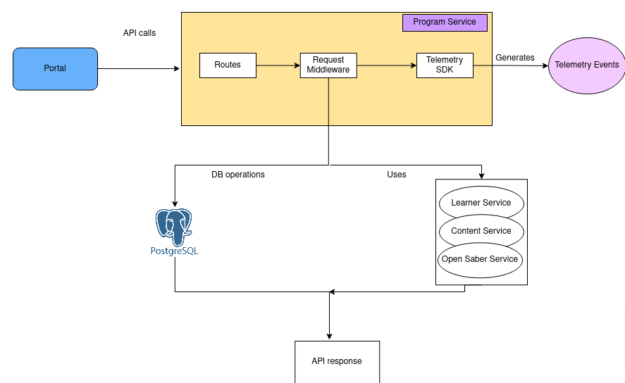

# Contribution(Program) Service Architecture

<figure><figcaption></figcaption></figure>

Contribution (Program) service, offers the APIs for creating and managing projects, their nominations, setting and reading user preferences, reading the configuration, getting the list of tenants and projects reports, etc. It stores information about the sourcing projects, their nominations, and configuration.

**Routes**\
&#x20;\
It handles all the API routes triggering from portal with end point program/\*\

**Request Middleware**

Request middleware provide methods to validate the tokens passed through API headers, create and validate request body, create response object etc.

Request middleware then foreword the request to correct service file to perform DB operations OR correct other BB service.&#x20;

