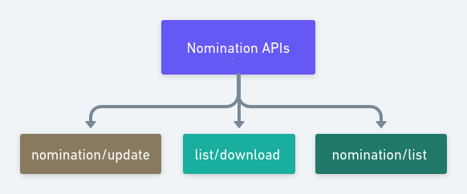

# Contribution Service

The Contribution microservice enables organizations to digitally plan, coordinate and manage crowdsourcing of assets for defined projects.

Contribution service offers the APIs for creating and managing projects, their nominations, setting and reading user preferences, reading the configuration, getting the list of tenants and projects reports, etc. It stores information about the sourcing projects, their nominations, and configuration.

### Program APIs

Program APIs provide the ability to organizations to create and manage projects to get the crowdsourcing of assets.

.png>)

**Key features**

* [**Create project**](https://documenter.getpostman.com/view/25186239/2s935ivSkP#cd6f8eda-d0ca-4c97-a118-924d1cce7d83): This API creates the project to get the crowdsourcing of assets. Project by default is kept in draft mode and can be published later once the creator is ready to go live.&#x20;
* [**Update project**](https://documenter.getpostman.com/view/25186239/2s935ivSkP#11d24652-1c07-4982-84f3-06a424447eff): This API provides the ability to update the project details. For the published (Live) project only specific details are allowed to update e.g Project title, description, nomination and contribution dates.
* [**Publish project**](https://documenter.getpostman.com/view/25186239/2s935ivSkP#c13730d7-016f-475f-a874-9d8fa237aa00): The contribution organization or individual contributor can view and contribute the assets to only publish the project. This API enables the ability to publish the project.
* [**Unlist publish project**](https://documenter.getpostman.com/view/25186239/2s935ivSkP#24d202e7-d361-4081-b20e-88d33d57d30a): This API provides control to get the contribution only from the organization that created the project.
* [**Project list**](https://documenter.getpostman.com/view/25186239/2s935ivSkP#dd6636de-c7c0-40ae-b0cb-558df7635918): This API provides the list of projects available in a system. This API has the ability to apply filters.
* [**List download**](https://documenter.getpostman.com/view/25186239/2s935ivSkP#e310c537-d7db-4f0e-842b-88701ca5a6e1): This API can be used to download the project details with insight full details like the number of nominations received, contribution received, sample received, contribution rejected, project metadata etc.
* [**Read project**](https://documenter.getpostman.com/view/25186239/2s935ivSkP#eba06746-f44e-4aa3-ae77-e3ddc2a8d362): This API returns the entire project details.

### Nomination APIs

Nomination APIs provide the ability to nominate and manage nominations made to the project.&#x20;

#### API Documentation

Click [here](https://documenter.getpostman.com/view/25186239/2s935ivSkP#803946b4-b678-4a80-92ea-fdf06b73dde4) for Nomination APIs

### Report API

Report API generates the report of the approved asset contributed to the project.

#### API Documentation

Click [here](https://documenter.getpostman.com/view/25186239/2s935ivSkP#7a2dc25e-b8a7-4b56-b3d1-e9ee4def3372) for Report APIs&#x20;

### Configuration Search API

Configuration search API supports searching the configuration by its key and status. The configuration entity provides the ability to mark configuration as active/ inactive. This configuration entity can be used to maintain a variety of configurations such as email/ SMS template configuration.&#x20;

#### API Documentation

Click [here](https://documenter.getpostman.com/view/25186239/2s935ivSkP#26d927e9-ebe5-4334-997b-dc452a13ac27) for Configuration Search API

### Tenant List API

Tenant list API enables the ability to get a list of sourcing organizations that wants crowdsourcing of assets from the contributor for their projects. Tenant list API supports the filters, it can be used to get the active(live) / inactive tenant list.

#### API Documentation

Click [here](https://documenter.getpostman.com/view/25186239/2s935ivSkP#331bb0f5-d707-4f6e-aaa6-c516f35b7040) for Tenant List API

### Preference API

Preference APIs provide the ability to add, update, read user and project preferences.&#x20;

#### API Documentation

Click [here](https://documenter.getpostman.com/view/25186239/2s935ivSkP#aaf6cd02-afa6-434e-a59c-277983299b7c) for Preference API

#### API Documentation:

[https://documenter.getpostman.com/view/25186239/2s935ivSkP](https://documenter.getpostman.com/view/25186239/2s935ivSkP)

### Source Code




