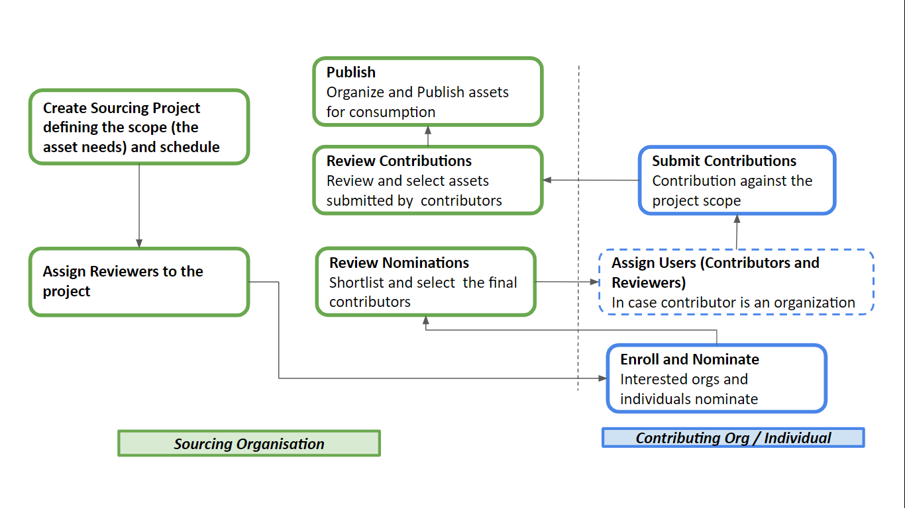

# Asset Sourcing

coKreat broadly enables two use cases for organizations:

* As an organization, I want to **create** content using in-house resources
* As an organization, I want to **co-create** content by sourcing it from other organizations or individuals

### **Co-create Vs Create - Scale is the difference**

Traditionally, organizations that have digital asset needs for the sake of learning, assessing, teaching, training - for education or any kind of human development purpose - have primarily followed two approaches:

Create all the assets on their own, using the resources available within their organization&#x20;

_OR_

Get the assets created from one or more providers on a need basis

This is a typical “C**reate**” approach. While this might work well for small scale needs, it doesn’t serve large scale needs well. For example, if there is a need for a government to provide digital learning assets to their students and teachers across their country, this approach of “creation” becomes quite a limitation. We often find organizations scrambling for resources to create assets for such large scale needs. Even if the assets are created as a one time activity, managing them and keeping them up to date with changing/growing needs becomes quite difficult.

This is where a “**co-create**” approach can help. Co-creation is a process of engaging with various ecosystem partners and orchestrating the efforts of creating and sourcing assets, rather than creating all by a single organization. Through this approach, digital assets can be sourced in several ways:

1. Assets are created in-house within the organization
2. Assets are sourced from a controlled set of asset providers or partners
3. Assets are crowdsourced from a large set of contributors who are willing to contribute the assets. The contributors may already have the required assets with them or have capability to create them.

The key processes for the “co-create” approach to work are:

1. Engagement with partners and contributors by providing them with recognition and data about their contributions
2. Curation of large pool of assets that can potentially come from contributors&#x20;

Considering the above, **Sunbird coKreat** provides tools and services to engage a wide ecosystem to collect, curate, publish, monitor, and reward the contributions.

It is an evolving software designed to be configurable, extendable to serve multiple needs. It enables a set of process flows for the orchestration and can be easily enhanced, extended for further needs.

### Key Actors and Actions in Co-creation Process

#### Level 1: High level actors and actions 

#### Actors 

**Sourcing Organization** - An organization that has asset needs for various business use cases. The organization would want to seek and publish the assets for the consumption by their users.

**Contributor** - An individual or an organization that contributes assets which can be used by one or more Sourcing Organizations.

#### Actions 

**Seek** - Sourcing Organization seeks content for its defined needs from contributors, chooses the assets contributed, and publishes it for consumption

**Contribute** - Contributor nominates for contribution, contributes assets

#### Level 2: Detailed set of actors and actions 

#### Sourcing Organization 

| **L2 Actor(s)**                                                           | **Action(s)**                                                                                                                                                         |
| ------------------------------------------------------------------------- | --------------------------------------------------------------------------------------------------------------------------------------------------------------------- |
| Administrator                                                             | **Set Up** Sourcing Organization                                                                                                                                      |
| Administrator                                                             | **Create** Sourcing Project(s)                                                                                                                                        |
| Administrator                                                             | **Assign** Users with their Roles to a Sourcing Project                                                                                                               |
| Administrator                                                             | **Choose** Contributors to a Sourcing Project                                                                                                                         |
| Administrator                                                             | **Monitor** the usage of the published assets from its consumption                                                                                                    |
| Administrator                                                             | **Analyze** the usage and feedback of the published assets from its consumption for improvement                                                                       |
| Creator                                                                   | **Create** assets as per the requirements                                                                                                                             |
| 
Reviewer

(Note: Administrator can also play a Reviewer role)
 | 
<strong>Curate and Publish</strong> created and contributed assets for consumption.

<strong>Curate</strong> includes reviewing and organizing the assets
 |

#### Individual Contributor 

| **Actor**              | **Action**                            |
| ---------------------- | ------------------------------------- |
| Individual Contributor | **Enroll** as a contributor           |
| Individual Contributor | **Nominate** to contribute            |
| Individual Contributor | **Contribute** assets                 |
| Individual Contributor | Monitor usage of the published assets |

#### Contributor Organization 

| **Actor**                                                                 | **Action**                                                               |
| ------------------------------------------------------------------------- | ------------------------------------------------------------------------ |
| Administrator                                                             | **Enroll** as a contributor                                              |
| Administrator                                                             | **Nominate** to contribute                                               |
| Administrator                                                             | **Assign** Users with their Roles to a Sourcing Project for contribution |
| Administrator                                                             | **Review and Submit** contributed assets to Sourcing Organization        |
| Administrator                                                             | **Monitor** the usage of the published assets from its consumption       |
| 
Reviewer

(Note: Administrator can also play a Reviewer role)
 | **Review and Submit** contributed assets to Sourcing Organization        |
| Contributor                                                               | **Contribute** assets                                                    |

### Process Flows 

Here is a high level process workflow depicting the co-creation orchestration:

### Source Code



In the subsequent pages, we will detail _'How'_ part of each of these process workflows.&#x20;

