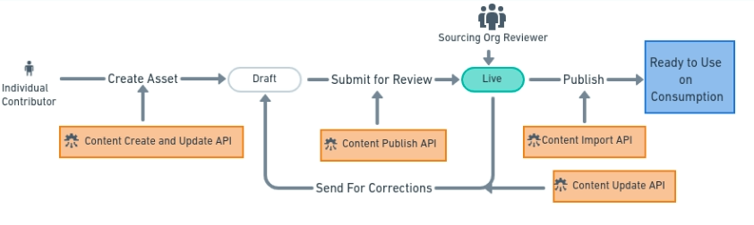
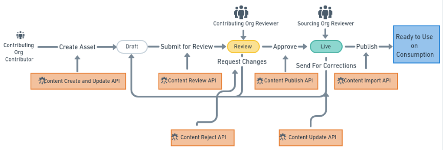

# Asset Contribution Lifecycle

The asset contribution lifecycle varies depending on whether the user has enrolled as an individual contributor or as an contributor organization.

### For an individual contributor 

Lifecycle of learning assets is a 3 stage cyclic process. Learning Assets follow maker checker method for assets creations.&#x20;

Draft  --> Live --> Publish ( Import on consumption )

The initial stage of asset creation is Draft. In this stage asset creation happens.&#x20;

After the creation, when submitted for review, asset move to the Live state where the sourcing org reviewer can Publish or Reject or send back the asset for corrections.

If the asset is **sent back for corrections** asset's status will change from Live to Draft. If the sourcing org reviewer **publishes** the asset then the asset will be available for consumption. If the sourcing org reviewer **rejects** the asset, it just stays in Live state in coKreat sourcing repository.

### For a contributor of contributing org  

Lifecycle of learning assets is a 4 stage cyclic process.&#x20;

Draft --> Review --> Live  --> Publish __ ( Import on consumption )\

The initial stage of asset creation is Draft. In this stage asset creation happens.&#x20;

After the asset is created, when it is submitted for review, asset will move to the Review stage. In this stage, the contributing org reviewer can Accept the asset as is or Request changes to be done.

Asset, requested for changes, moves back to Draft Stage. If accepted, the Asset is made Live.&#x20;

Sourcing Org reviewer can then Publish or Reject or send the asset for corrections.
