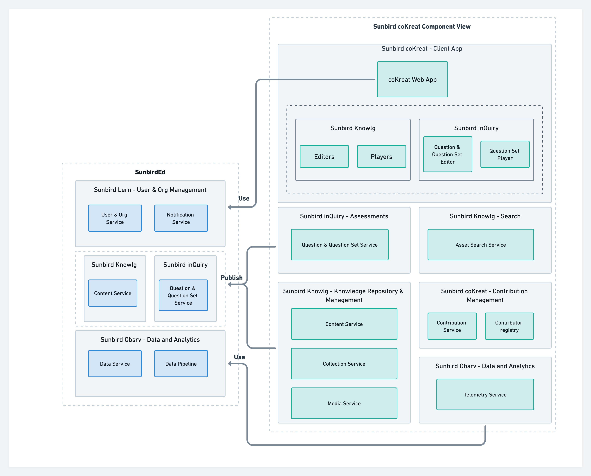

# Technical Architecture

Below diagram shows list of components & building blocks deployed in coKreat and its dependent components in the sunbirdEd building block.

## **Component view diagram**


[architecture-component-diagram.md](../use/developer-guide/reference-cokreat-web-app/architecture-component-diagram.md)


## Video - coKreat Tech Architecture


