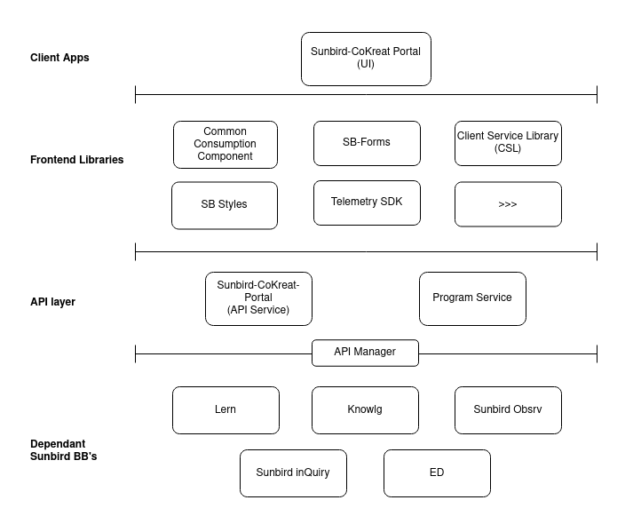

# Architecture

Below architecture diagram explains L0 architectural view of Sunbird-ED

<figure><figcaption>
L0 Architecture 
</figcaption></figure>

### Client APPs

The client APPs for portal architecture mainly includes the front-end or client source code for the Angular application. Includes. This folder includes various components, modules, services, styles, and other assets necessary to build the front end of the application.&#x20;

### Front-end Libraries

The angular libraries are designed to be used in portal to drive re-usability, maintainability hence reducing the redundant development effort significantly.&#x20;

### API Layer

Includes back-end API interface which built in Node.js framework.&#x20;

### Dependant Sunbird BBs

coKreat portal uses lots of services and front-end libraries from other building blocks like inQuiry, Ed, knowlg, lern, obServe.
