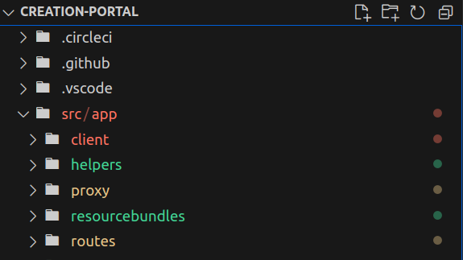

# Component Diagrams

## GitHub Repository



## Architecture

<figure><figcaption>
L1 architecture
</figcaption></figure>

Each block of the architecture is explained in the document.&#x20;

## Portal code structure

<figure><figcaption></figcaption></figure>

There are two folders coKreat Portal is made up of:\
\
[app folder](component-diagrams.md#api-layer-portal-api-services) => The base folder which can be also called as back-end application of portal, serves as API service layer. It authenticate and validates and then routes the API calls executed from the front-end. The front-end Application folder ( client ) resides under app. &#x20;

[client folder](component-diagrams.md#cokreat-portal-ui) => Portal front-end angular code (modules, components, services). User can perform various action through UI when compiled by browser.&#x20;

### **coKreat Portal UI**&#x20;

The client folder includes the source code for the Angular application. This folder includes various components, modules, services, styles, and other assets necessary to build the front end of the application.

<figure><figcaption></figcaption></figure>

[**Program Module**](https://sunbird-cokreat.github.io/docs/coKreat/modules/ProgramModule.html)

The program module enables user to perform various action through Sourcing portal. \
&#x20;When the Organisation admin logs in to sourcing portal, program module gets loaded in the browser.  Program module uses Sourcing, shared, shared Feature, core modules and their components and services. \
Following actions a sourcing organisation user can perform through UI powered by Program module:\
\- Create project using collections or question set or framework categories.\
\- Manage projects created by his organisation. \
\- Manage users added under his organisation. He can add them as a reviewer or admin on the global level of the organisation.\
\- Download various organisation level reports.\
\- For each project, manage nominations.\
\- For each project, manage contents added by different contributors.\
\- For each project, add reviewers to the  project.\
\- Download program level reports.&#x20;

[**Contribute Module**](https://sunbird-cokreat.github.io/docs/coKreat/modules/ContributeModule.html)

Contribute module enables user to perform various action through contribute portal.\
It provides user UI through which contributing org admins and its users can perform various actions. Contribute module uses Sourcing, shared, shared Feature, core modules and their components and services.

Following actions user can perform through UI powered by Contribute module:\
\- Enrol as a Individual contributor or Contributing Organisation. \
\- See project list created by different souring organisations.\
\- Nominate to any project \
\- See Project list his contributing organisation has nominated to\
\- Add contributors or reviewers to the project\
\- Enables contributor org contributor to contribute various contents to the project.

[**Sourcing Module**](https://sunbird-cokreat.github.io/docs/coKreat/modules/ContributeModule.html)

Reusable components to show Collection TOC (chapterList component), to upload contents (contentUploader ), To Create Questions and question sets, Bulk upload and bulk Approval component

[**Shared Module**](https://sunbird-cokreat.github.io/docs/coKreat/modules/SharedModule.html)

The reusable code to show loaders, no result found messages, Help messages etc

[**Shared Feature Module**](https://sunbird-cokreat.github.io/docs/coKreat/modules/SharedFeatureModule.html)

The views which are reused on both sourcing and contribute portal such as program list, textbook list, Program filters, program headers, Organization user list&#x20;

[**Core Module**](https://sunbird-cokreat.github.io/docs/coKreat/modules/CoreModule.html)

Core components to show main headers, Footer, and services like program, content etc

[**Telemetry Module**](https://sunbird-cokreat.github.io/docs/coKreat/modules/TelemetryModule.html)

Module being used to handle telemetry events

## Front-End Libraries

The angular libraries are designed to be used in portal to drive re-usability, maintainability hence reducing the redundant development effort significantly.&#x20;

<figure><figcaption></figcaption></figure>

The following NPM packages which are listed in package.json and are installed in front-end client folder:

<table><thead><tr><th width="362">Sunbird Common Libraries</th><th>GitHub Repo</th></tr></thead><tbody><tr><td>Sunbird Client Services</td><td><a href="https://github.com/Sunbird-Ed/sunbird-client-services">https://github.com/Sunbird-Ed/sunbird-client-services</a></td></tr><tr><td>Sunbird Collection Editor</td><td><a href="https://github.com/Sunbird-Knowlg/sunbird-collection-editor">https://github.com/Sunbird-Knowlg/sunbird-collection-editor</a></td></tr><tr><td>Sunbird Generic Editor</td><td><a href="https://github.com/Sunbird-Knowlg/sunbird-generic-editor">https://github.com/Sunbird-Knowlg/sunbird-generic-editor</a></td></tr><tr><td>Sunbird ePub Player</td><td><a href="https://github.com/Sunbird-Knowlg/sunbird-epub-player">https://github.com/Sunbird-Knowlg/sunbird-epub-player</a></td></tr><tr><td>Sunbird Video Player</td><td><a href="https://github.com/Sunbird-Knowlg/sunbird-video-player">https://github.com/Sunbird-Knowlg/sunbird-video-player</a></td></tr><tr><td>Sunbird PDF player</td><td><a href="https://github.com/Sunbird-Knowlg/sunbird-pdf-player">https://github.com/Sunbird-Knowlg/sunbird-pdf-player</a></td></tr><tr><td>Sunbird quml Player</td><td><a href="https://github.com/project-sunbird/sunbird-quml-player">https://github.com/project-sunbird/sunbird-quml-player</a></td></tr><tr><td>Sunbird Telemetry SDK </td><td><a href="https://github.com/project-sunbird/sunbird-telemetry-sdk">https://github.com/project-sunbird/sunbird-telemetry-sdk</a></td></tr><tr><td>Sunbird Styling Library</td><td><a href="https://github.com/Sunbird-Ed/sb-styles">https://github.com/Sunbird-Ed/sb-styles</a></td></tr></tbody></table>

### **API Layer- Portal API Services**

The APP folder which can be also called as back-end application of portal, serves as API service layer. It authenticate and validates and then routes the API calls executed from the front-end. &#x20;

It leverages a keyCloakHelper file to handle login and logout functionalities while adopting token-based session storage to manage user sessions effectively.&#x20;

Additionally, the interface integrates multiple API middleware functions to accomplish tasks such as token verification, API whitelisting, and customising request headers as needed.

<figure><figcaption></figcaption></figure>

Following files/folders has the code to carry out routing, API whitelist  checking and authorising etc.

[**Server.js**](https://github.com/Sunbird-coKreat/creation-portal/blob/release-6.0.0/src/app/server.js)

It is used in web development for the server-side entry point of a Node.js application. It acts as the main starting point of the server, responsible for initializing the server, defining routes, and handling incoming requests from clients.

[**Routes**](https://github.com/Sunbird-coKreat/creation-portal/tree/release-6.0.0/src/app/routes)

It handles all the API routes. which are triggering from the client side.&#x20;

[**EnvironmentVariables: Helpers Folder**](https://github.com/Sunbird-coKreat/creation-portal/blob/release-6.0.0/src/app/helpers/environmentVariablesHelper.js)

This file is responsible for storing the env variable that is required in the portal from DevOps.

[**API Whitelisting: Helpers Folder**](https://github.com/Sunbird-coKreat/creation-portal/tree/release-6.0.0/src/app/helpers)

Contains all the js files which are used for user [authentication](https://github.com/Sunbird-coKreat/creation-portal/blob/release-6.0.0/src/app/helpers/kongTokenHelper.js) and [authorization](https://github.com/Sunbird-coKreat/creation-portal/blob/release-6.0.0/src/app/helpers/keyCloakHelper.js). Contains the [API Whitelist](https://github.com/Sunbird-coKreat/creation-portal/blob/release-6.0.0/src/app/helpers/apiWhiteList.js) js file which Handles whitelisting and role checks of Portal API(s).

#### [Proxy](https://github.com/Sunbird-coKreat/creation-portal/tree/release-6.0.0/src/app/proxy)

It contains the set-up method such as decoraterequestHeader, verifyToken, and isApiwhitelisted which validates whether the API request is valid or not with proper role check and auths token.

[**ResourceBundles**](https://github.com/Sunbird-coKreat/creation-portal/tree/release-6.0.0/src/app/resourcebundles)

It contains the resource bundles for internationalization and localization purposes in the application. it is used for translations and provides a seamless way to display the application's user interface in different languages based on user preferences.



### **Dependent Sunbird BBs**

Lots of front-end Libraries and services we are leveraging from the other building blocks.

<figure><figcaption></figcaption></figure>

#### **Sunbird Building Blocks which are being used in coKreat Portal**

* [Lern](https://lern.sunbird.org/)
* [Obsrv](https://obsrv.sunbird.org/)
* [inQuiry](https://inquiry.sunbird.org/learn/readme)
* [knowlg](https://knowlg.sunbird.org/learn/readme)
* [Ed](https://ed.sunbird.org/learn/readme)

\
