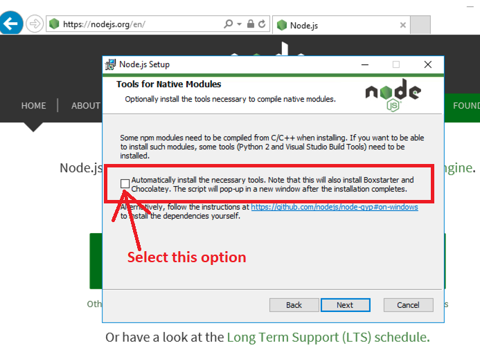

# Windows Installation

### Pre - required programs

* Python 2.7.18&#x20;

[Note : If your machine has python 3+ installed, please downgrade it to 2.7](#user-content-fn-1)[^1]

### Follow-up steps&#x20;

* Download and install node version 14.18.1 and run the installer. Choose a directory, then select Next.
* When it asks to install tools for Node JS, check the box for Automatically install the necessary tools

&#x20;

* Install Angular CLI: 13.3.3&#x20;
* Create git account&#x20;
* Clone the repo from : https://github.com/Sunbird-Ed/creation-portal.git

### Run the application server&#x20;

* Open command prompt&#x20;
* Change directory to ..\creation-portal\src\app
* Run command `set NODE_OPTIONS=--max_old_space_size=4096`&#x20;
* Run command `npm i`&#x20;
* Run command `npm run resource-bundles`&#x20;
* Run command `set sunbird_environment="local"`&#x20;
* Run command `set sunbird_instance="sunbird"`&#x20;
* Run command `set sunbird_default_channel="sunbird"`&#x20;
* Run command `set sunbird_default_tenant="sunbird"`&#x20;
* Run command `node server`

### Run the client&#x20;

* Open another command prompt window&#x20;
* Change directory to ..\creation-portal\src\app\client&#x20;
* Rename `mv` command in `package.json` to `move` command
* Run `npm i`
* Run `npm install nodemon`&#x20;
* Run command `nodemon`&#x20;

Open `http://localhost:3000/sourcing` on a browser tab

[^1]: 
